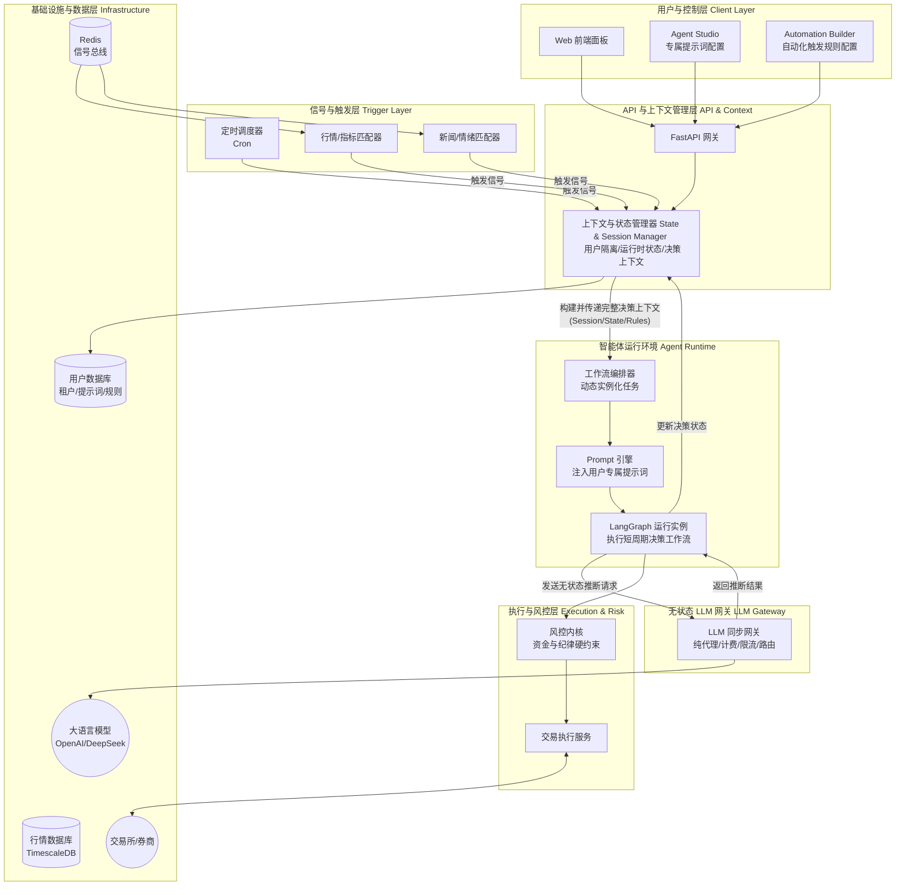
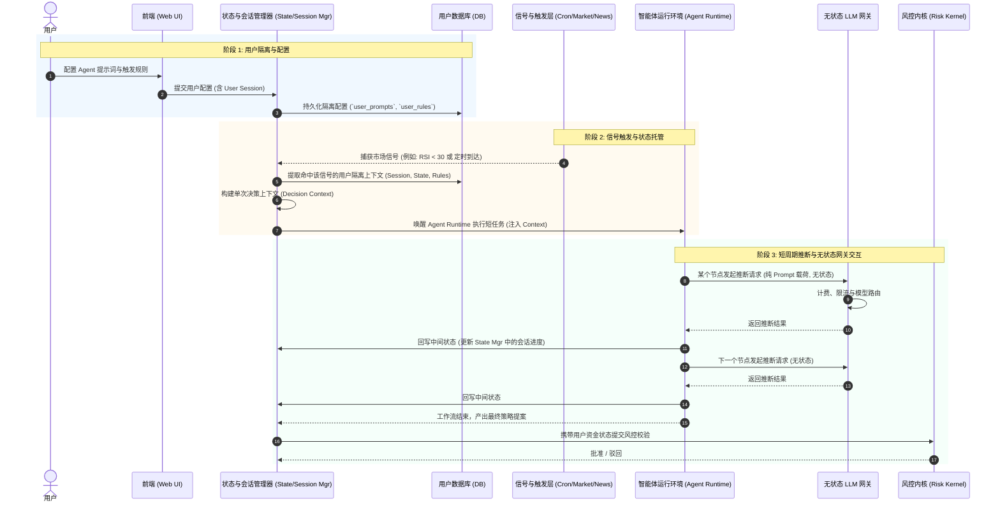

# 中心化 SaaS 版本架构设计

## 一、 整体系统架构图 (Architecture Diagram)

该架构图展示了系统各模块的层级关系以及中心化改造后引入的新组件（如 Trigger Engine 和多租户上下文）。

---

## 二、 核心数据流程图 (Data Flow Diagram)

该数据流图详细描述了从信号产生、匹配用户规则，到 AI 团队动态加载提示词并最终执行交易的完整闭环。

