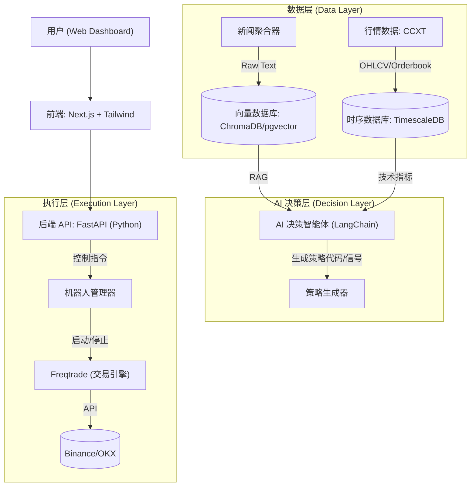
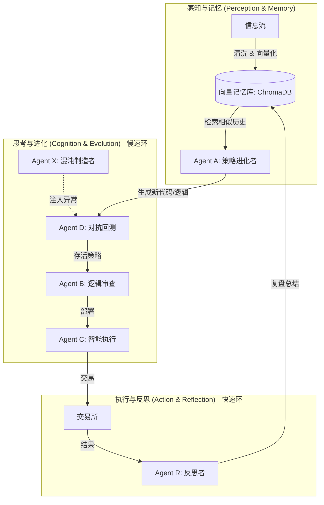

# 技术架构设计文档 (Technical Design Document)

## 1. 总体架构
本项目采用**微服务/模块化架构**，前后端分离。核心分为四个层次：**数据层 (Data Layer)**、**决策层 (Decision Layer)**、**执行层 (Execution Layer)** 和 **交互层 (Interface Layer)**。

### 1.1 系统数据流架构

### 1.2 认知进化架构 (The Cognitive Trader)
本架构引入了**双环进化机制**（快速执行环 + 慢速学习环），通过反思和记忆实现 AI 的自我进化。

## 2. 技术栈选型

### 2.1 前端 (Frontend)
*   **框架**: **Next.js 14+** (React, App Router)。
*   **语言**: **TypeScript**。
*   **UI 组件库**: **Shadcn/ui** + **Tailwind CSS**。
*   **图表库**: **Lightweight-charts** (TradingView 开源的高性能 K 线图库)。
*   **状态管理**: **Zustand** 或 **React Query** (TanStack Query)。
*   **WebSocket**: **Socket.io-client** 或原生 WebSocket (用于接收后端推送的实时行情/信号)。

### 2.2 后端 (Backend)
*   **框架**: **FastAPI** (Python)。
*   **语言**: **Python 3.10+**。
*   **任务队列**: **Celery** + **Redis** (用于异步处理新闻抓取、AI 推理任务)。
*   **WebSocket**: **FastAPI WebSockets** (用于向前端推送数据)。

### 2.3 数据存储 (Data Storage)
*   **时序数据库**: **TimescaleDB** (基于 PostgreSQL) —— 存储行情 K 线 (OHLCV)、深度数据。
*   **向量数据库**: **ChromaDB** 或 **pgvector** (PostgreSQL 插件) —— 存储新闻文本向量 (用于 RAG)。
*   **关系型数据库**: **PostgreSQL** —— 存储用户配置、交易记录、策略参数。
*   **缓存**: **Redis** —— 缓存热点数据（如最新价格、Token）、Celery 消息队列。

### 2.4 AI 与策略 (AI & Strategy)
*   **LLM 框架**: **LangChain** (构建 Agent, RAG 流程)。
*   **模型**:
    *   **决策/生成**: **GPT-4o** / **DeepSeek-V3** (通过 API 调用)。
    *   **情感分析**: **FinBERT** (本地部署，HuggingFace) 或 LLM API。
    *   **Embedding**: **OpenAI text-embedding-3-small** 或 **HuggingFace m3e**。
*   **Prompt 工程**:
    *   角色设定 (Role-Playing)。
    *   思维链 (Chain of Thought, CoT)。
    *   JSON 输出格式化。

### 2.5 交易执行 (Trading Execution)
*   **核心引擎**: **Freqtrade** (Python)。
    *   利用其完善的回测、风控、交易所对接能力。
    *   通过 REST API (`/api/v1/`) 与后端交互。
*   **数据连接**: **CCXT (Pro)** —— 获取实时行情，支持 WebSocket。

## 3. 核心模块设计

### 3.1 数据采集服务 (Data Ingestion Service)
*   **行情录制器 (Market Recorder)**:
    *   使用 `ccxt.pro` (异步) 连接 Binance WebSocket。
    *   订阅 `trade`, `kline_1m` 频道。
    *   数据清洗后批量写入 TimescaleDB。
*   **新闻抓取器 (News Fetcher)**:
    *   定时任务 (Celery Beat) 每 5 分钟调用 CryptoPanic API。
    *   抓取 RSS Feeds (CoinDesk 等)。
    *   使用 LLM/FinBERT 对标题进行情感打分 (-1 ~ 1)。
    *   存入 PostgreSQL (元数据) 和 ChromaDB (向量)。

### 3.2 AI 决策服务 (AI Decision Service)
*   **RAG 检索**:
    *   当用户提问或触发定时分析时，检索最近 24 小时的高相关性新闻。
*   **CoT 推理**:
    *   Prompt: "作为资深交易员，基于[新闻列表]和[技术指标]，分析 BTC 趋势..."。
    *   输出: JSON 格式 `{ "decision": "BUY", "confidence": 0.85, "reason": "..." }`。
*   **策略生成**:
    *   根据 LLM 分析结果，动态调整 Freqtrade 配置文件 (`config.json`) 或策略文件 (`strategy.py`)。

### 3.3 记忆与上下文管理 (Memory & Context Management)
为了解决 Agent 长期运行导致的上下文窗口溢出 (Context Overflow) 和记忆迷失 (Lost in the Middle) 问题，采用 **三级记忆架构 (Hierarchical Memory)**：

1.  **短期记忆 (Short-term / Working Memory)**:
    *   **内容**: 最近 10-20 轮对话、当前 K 线切片、即时新闻。
    *   **机制**: **FIFO 滑动窗口**。当对话轮数超过限制时，最早的记录移出窗口。
    *   **优化**: **观察掩码 (Observation Masking)**。对于工具调用（如 `get_klines` 返回的大量数据），在 LLM 处理完后，从历史消息中**删除具体的 Output 内容**，仅保留“数据已获取”的标记，大幅节省 Token。

2.  **中期记忆 (Medium-term / Episodic Memory)**:
    *   **内容**: 每日交易总结、策略变更记录、复盘报告。
    *   **机制**: **滚动摘要 (Rolling Summarization)**。每隔 24 小时或 50 轮对话，触发轻量级 LLM 将短期记忆压缩为 200 字摘要，保留在 System Prompt 中。

3.  **长期记忆 (Long-term / Semantic Memory)**:
    *   **内容**: 历史经典案例、宏观周期规律、成功的策略逻辑。
    *   **机制**: **RAG (检索增强)**。存储在向量数据库 (ChromaDB) 中。只有当当前市场状态（如 RSI > 80）与历史案例相似时，才检索 Top-3 相关记忆注入上下文。

### 3.4 交易执行服务 (Trade Execution Service)
*   **机器人管理器 (Bot Manager)**:
    *   控制 Freqtrade 进程的启动/停止 (Docker SDK)。
    *   通过 Freqtrade REST API 发送 `forcebuy`, `forcesell` 指令。
    *   监听 Freqtrade 的 webhook，获取成交状态并推送到前端。

## 4. 部署方案
*   **容器化**: 所有服务 (Frontend, Backend, DB, Redis, Freqtrade) 均通过 **Docker Compose** 编排。
*   **CI/CD**: GitHub Actions 自动化构建和测试。

## 5. 接口设计 (API Endpoints)
*   `GET /api/v1/market/kline?symbol=BTC/USDT&interval=1h` - 获取 K 线数据
*   `GET /api/v1/news/latest` - 获取最新新闻及情感分
*   `POST /api/v1/ai/analyze` - 触发 AI 分析 (输入: symbol)
*   `POST /api/v1/trade/execute` - 手动执行交易 (输入: action, amount)
*   `GET /api/v1/bot/status` - 获取 Freqtrade 机器人状态
